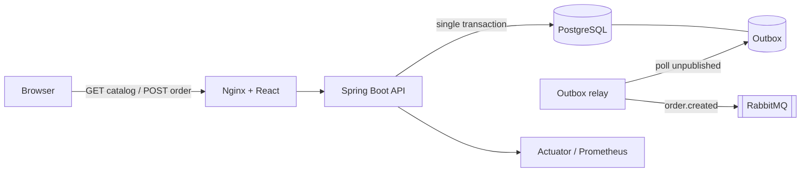
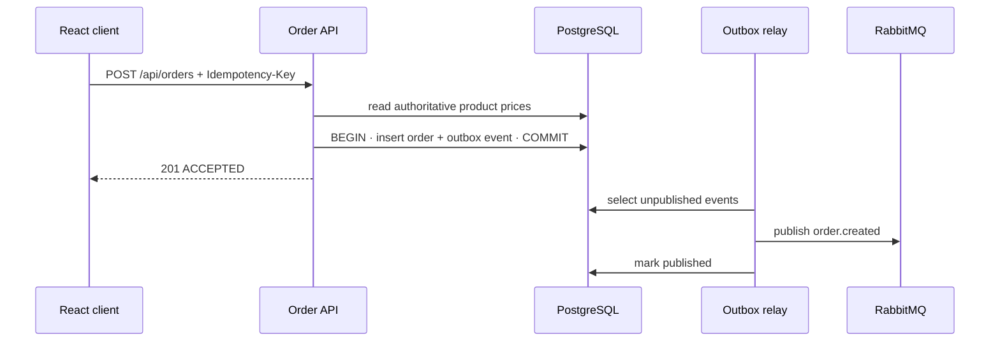

# EFFECT/OPS

> **Design the delight. Engineer the recovery.**  
> 몰입형 인터랙션, 신뢰할 수 있는 주문 처리, 이벤트 기반 아키텍처, 의도적인 장애 복구 경험을 하나로 묶은 풀스택 포트폴리오 프로젝트입니다.

[](https://github.com/taeyoungk-dev/custom_effect/actions/workflows/ci.yml)

## 프로젝트를 만든 이유

기존 세 프로젝트는 각각 강점이 분명했습니다.

| 원본 프로젝트 | 가져온 핵심 | EFFECT/OPS에서의 확장 |
|---|---|---|
| [`custom-cursor`](https://github.com/taeyoungk-dev/custom-cursor) | 커스텀 커서, 홀드 인터랙션, 패럴랙스, 포스터 아트 | `requestAnimationFrame` 기반 포인터 렌더링, 키보드 진입, reduced-motion 대응, 실제 상품 카탈로그 |
| [`404-error-page`](https://github.com/taeyoungk-dev/404-error-page) | UFO SVG와 404 애니메이션 | SPA 라우팅, 복구 CTA, 추적 ID, 접근 가능한 오류 상태 화면 |
| [`aks-store`](https://github.com/taeyoungk-dev/aks-store) | AKS의 스토어·주문·RabbitMQ 배포 모델 | Java 주문 API, PostgreSQL, Transactional Outbox, 보안 컨텍스트·probe·HPA·NetworkPolicy |

통합 과정의 목표는 화면 세 개를 단순히 붙이는 것이 아니었습니다. **사용자가 보는 인터랙션부터 데이터 일관성, 메시지 전달, 컨테이너 운영까지 한 번의 주문 흐름을 끝까지 설명할 수 있는 시스템**으로 재설계했습니다.

## 핵심 경험

- **Hold-to-enter 인트로** — 포인터와 키보드를 모두 지원하고 세션당 한 번만 표시됩니다.
- **커스텀 커서·패럴랙스** — 미세 포인터에서만 활성화되며, 애니메이션은 브라우저 프레임에 맞춰 갱신됩니다.
- **실제 카탈로그·장바구니** — API 연결 시 서버 데이터를 사용하고, 프론트만 실행해도 명시적인 Demo mode로 전체 UX를 확인할 수 있습니다.
- **멱등 주문 API** — `Idempotency-Key`로 네트워크 재시도 시 중복 주문을 방지합니다.
- **서버 측 금액 계산** — 클라이언트가 보낸 가격을 신뢰하지 않고 SKU와 수량만 받아 DB 가격으로 합계를 다시 계산합니다.
- **Transactional Outbox** — 주문과 발행할 이벤트를 같은 DB 트랜잭션에 저장하여 dual-write 유실 구간을 제거합니다.
- **이벤트 발행** — outbox relay가 `order.created`를 RabbitMQ topic exchange로 전달합니다.
- **관측 가능성** — Actuator health/readiness/liveness와 Prometheus metrics endpoint를 제공합니다.
- **의도적인 404 복구** — 알 수 없는 모든 경로를 UFO recovery mode로 연결합니다.
- **운영 자산** — Docker Compose 로컬 스택과 Kubernetes 리소스·HPA·NetworkPolicy를 함께 제공합니다.

## 아키텍처



주문 처리 시퀀스:



더 자세한 설계 결정과 장애 시나리오는 [`docs/architecture.md`](docs/architecture.md)에서 확인할 수 있습니다.

## 기술 스택과 선택 이유

| 영역 | 기술 | 선택 이유 |
|---|---|---|
| Frontend | React, TypeScript, Vite | 컴포넌트 상태와 타입 안전성, 빠른 로컬 피드백 |
| Interaction | CSS animation, SVG, `requestAnimationFrame`, Pointer API | 별도 애니메이션 라이브러리 없이 렌더링 원리와 접근성을 직접 제어 |
| Backend | Java 21, Spring Boot, Spring MVC, Bean Validation | 명확한 계층과 검증 가능한 트랜잭션 경계 |
| Persistence | Spring Data JPA, PostgreSQL, Flyway | 관계형 무결성, 반복 가능한 스키마 변경 |
| Messaging | RabbitMQ, Transactional Outbox | 요청 처리와 후속 작업을 분리하면서 이벤트 유실을 완화 |
| Security | Spring Security, stateless policy, CORS allowlist, security headers | 공개 API의 최소 허용 정책과 기본 브라우저 방어선 |
| Observability | Actuator, Micrometer, Prometheus | 컨테이너 probe와 운영 지표를 같은 애플리케이션 모델로 제공 |
| Platform | Docker, Compose, Kubernetes, Kustomize, HPA, NetworkPolicy | 개발-운영 간 실행 환경 일관성과 확장·격리 정책 명시 |
| Quality | JUnit, MockMvc, Vitest, Testing Library, GitHub Actions | API 계약·멱등성·사용자 흐름을 자동 검증 |

이 구성은 목표 로드맵의 **Java Backend → Cloud/Data → Security** 순서를 한 저장소에서 자연스럽게 설명하도록 의도했습니다. 사용하지 않은 기술을 README에 나열하지 않고, 실제 코드와 운영 파일이 있는 기술만 기재했습니다.

## 저장소 구조

```text
custom_effect/
├── web/                         # React + TypeScript storefront와 404 recovery UI
│   ├── public/                  # 통합한 이미지·UFO SVG 자산
│   └── src/                     # UI, API adapter, 테스트
├── server/                      # Java 21 Spring Boot 주문 서비스
│   └── src/
│       ├── main/java/           # catalog, order, platform, security
│       ├── main/resources/      # 설정과 Flyway migration
│       └── test/                # 주문 통합 테스트
├── infra/k8s/                   # Kubernetes/Kustomize 배포 사양
├── docs/architecture.md         # 트레이드오프와 장애 모델
├── compose.yml                  # PostgreSQL + RabbitMQ + API + Web
└── .github/workflows/ci.yml     # Web/API/Compose 검증
```

## 로컬에서 실행하기

### 1. UI를 가장 빠르게 보기

요구 사항: Node.js 22+, npm 10+

```bash
cd web
npm install
npm run dev
```

브라우저에서 [http://localhost:5173](http://localhost:5173)을 엽니다. API가 없으면 상단 카탈로그 배지가 `DEMO DATA`로 표시되고, 주문은 `demo-...` ID로 시뮬레이션됩니다. 시각·장바구니·404 흐름은 모두 동작합니다.

인트로를 다시 보려면 브라우저 개발자 도구의 Session Storage에서 `effect-ops-intro`를 지우거나 새 시크릿 창을 사용하세요.

### 2. 전체 시스템을 Docker로 실행하기 — 권장

요구 사항: Docker Desktop 또는 Docker Engine + Compose v2

```bash
cp .env.example .env
# .env의 로컬 비밀번호를 원하는 값으로 변경
docker compose up --build
```

| 서비스 | 주소 |
|---|---|
| EFFECT/OPS 웹 | [http://localhost:8088](http://localhost:8088) |
| API health | [http://localhost:8088/actuator/health](http://localhost:8088/actuator/health) |
| RabbitMQ 관리 UI | [http://localhost:15672](http://localhost:15672) |

종료:

```bash
docker compose down
```

DB 볼륨까지 제거하려는 경우에만 `docker compose down -v`를 사용하세요. 이 명령은 로컬 주문 데이터를 삭제합니다.

### 3. API만 직접 실행하기

요구 사항: JDK 21, Maven 3.9+

```bash
cd server
mvn spring-boot:run
```

기본 프로필은 인메모리 H2와 `MESSAGING_ENABLED=false`를 사용하므로 PostgreSQL·RabbitMQ 없이 시작됩니다. 프론트 개발 서버는 `/api`를 `localhost:8080`으로 프록시합니다.

## API 사용 예시

카탈로그:

```bash
curl http://localhost:8080/api/products
```

주문 생성:

```bash
curl -i http://localhost:8080/api/orders \
  -X POST \
  -H 'Content-Type: application/json' \
  -H 'Idempotency-Key: portfolio-demo-001' \
  -d '{
    "email": "engineer@example.com",
    "items": [
      {"sku": "SIGNAL-01", "quantity": 2},
      {"sku": "ORBIT-02", "quantity": 1}
    ]
  }'
```

같은 `Idempotency-Key`로 재요청하면 새로운 주문·이벤트를 만들지 않고 기존 주문을 반환합니다.

| Method | Endpoint | 설명 |
|---|---|---|
| `GET` | `/api/products` | SKU 순으로 카탈로그 조회 |
| `POST` | `/api/orders` | 주문·outbox event 원자적 생성 |
| `GET` | `/api/platform/status` | UI용 서비스 상태 요약 |
| `GET` | `/actuator/health` | 컨테이너 health 및 probe |
| `GET` | `/actuator/prometheus` | Prometheus scrape endpoint |

## 테스트와 정적 검증

```bash
# Frontend: TypeScript + UI tests + production build
npm install --prefix web
npm run check
npm test
npm run build

# Backend: Flyway + Spring context + MockMvc integration tests
cd server
mvn verify

# Compose 문법
docker compose config --quiet

# Kubernetes 렌더링
kubectl kustomize infra/k8s
```

CI는 pull request와 `main` push마다 위 검증을 분리 실행합니다. backend 테스트는 다음을 구체적으로 확인합니다.

1. 초기 카탈로그 3개가 노출되는가
2. 같은 멱등 키를 두 번 보내도 주문과 outbox event가 각각 하나인가
3. 멱등 키가 없는 요청을 `400 INVALID_ORDER`로 거절하는가

## Kubernetes 배포 메모

`infra/k8s`는 포트폴리오용으로 실행 가능한 베이스 리소스를 담지만, 운영 DB는 클러스터 외부의 managed PostgreSQL을 전제로 합니다.

```bash
cp infra/k8s/secret.example.yaml /tmp/effectops-secret.yaml
# /tmp/effectops-secret.yaml 값을 실제 secret으로 교체
kubectl apply -f /tmp/effectops-secret.yaml
kubectl apply -k infra/k8s
```

배포 전 반드시 아래를 환경에 맞게 바꿔야 합니다.

- `api.yaml`, `web.yaml`의 GHCR image tag를 immutable SHA tag로 고정
- `configmap.yaml`의 CORS origin 변경
- 평문 secret 대신 External Secrets/Sealed Secrets/cloud secret manager 사용
- Ingress, TLS, managed PostgreSQL, backup policy 연결
- HPA 사용을 위한 Metrics Server 확인

## 신뢰성·보안 설계 포인트

- **at-least-once 전달을 전제로 함:** outbox relay가 발행 후 DB 표시 전에 종료되면 이벤트가 재발행될 수 있습니다. downstream consumer는 `event-id` 기준 멱등 처리가 필요합니다.
- **주문 응답과 메시지 브로커를 분리:** RabbitMQ가 잠시 중단되어도 주문 자체는 PostgreSQL에 수락되며, 복구 후 relay가 미발행 이벤트를 전송합니다.
- **클라이언트 가격 불신:** API request에는 SKU와 수량만 존재합니다. 가격·합계는 서버가 권위 데이터로 계산합니다.
- **공개 경로 최소화:** Spring Security에서 필요한 API와 health/metrics만 허용하고 나머지는 거절합니다.
- **컨테이너 권한 축소:** non-root, capability drop, read-only filesystem(API)을 Kubernetes에 선언합니다.
- **네트워크 기본 차단:** namespace ingress를 기본 거절하고 Web→API, API→RabbitMQ만 허용합니다.
- **민감정보 분리:** 실제 credential은 저장소에 커밋하지 않으며 예시 secret만 제공합니다.

## 현재 범위와 다음 단계

이 프로젝트는 포트폴리오 데모이며 실제 결제·개인정보 저장은 구현하지 않았습니다. 다음 확장은 기술을 “추가했다”는 체크리스트가 아니라 측정 가능한 문제를 해결하는 순서로 계획했습니다.

- Testcontainers로 PostgreSQL/RabbitMQ 통합 테스트 및 relay 재시도 검증
- OpenTelemetry trace를 도입해 `client → API → DB → broker` 상관관계 표시
- Redis 기반 재고 reservation과 TTL 만료 시나리오
- consumer 서비스와 dead-letter queue, replay 도구
- k6 부하 테스트로 p95 latency·처리량 SLO 수치화
- OAuth2/OIDC 관리자 화면과 감사 로그
- Terraform/Bicep 기반 AKS·managed PostgreSQL·monitoring 재현

## 포트폴리오에서 설명할 수 있는 것

- “세 개의 독립된 프론트/인프라 실습을 사용자 여정 중심의 풀스택 시스템으로 통합했습니다.”
- “멱등 키와 서버 측 재계산으로 재시도·클라이언트 변조 문제를 다뤘습니다.”
- “주문과 이벤트 사이 dual-write 문제를 Transactional Outbox로 줄이고, 중복 전달은 consumer 멱등성으로 해결해야 함을 명시했습니다.”
- “개발용 fallback, Docker Compose, Kubernetes까지 실행 환경을 단계화하고 CI에서 각 계약을 검증했습니다.”
- “커스텀 인터랙션을 유지하면서 reduced-motion·키보드 조작·coarse pointer를 고려했습니다.”

## Author

**김태영 (Taeyoung Kim)**  
[GitHub](https://github.com/taeyoungk-dev) · [LinkedIn](https://www.linkedin.com/in/katiekim412) · [Email](mailto:katiekim412@gmail.com)

> 이 저장소의 별도 라이선스는 아직 지정하지 않았습니다. 외부 공개·재사용 정책을 정한 뒤 LICENSE를 추가할 예정입니다.

